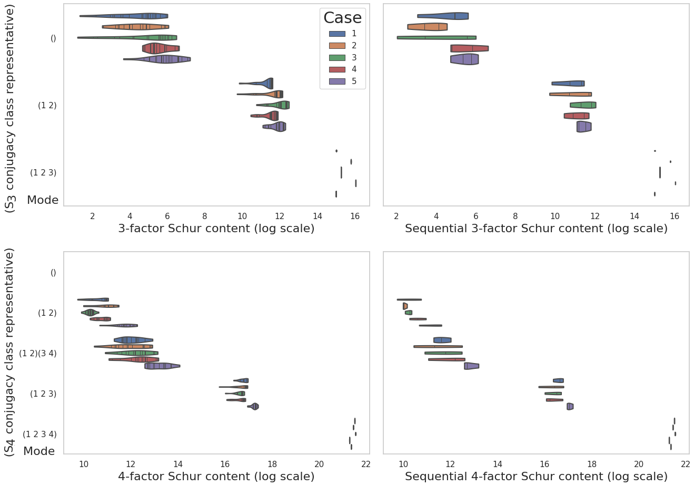

Schur transform
===============

This is an implementation of the algorithm described in [*A Schur Transform for Spatial Stochastic Processes*](https://arxiv.org/abs/1811.06221). The transform calculates irreducible tensorial components of spatial joint moments and their amplitudes. See also Persi Diaconis' [Group Representations in Probability and Statistics](https://www.jstor.org/stable/4355560) for background on the non-abelian Fourier transform in the context of the symmetric group.

Let's say that your data are stored in a multi-dimensional array `v[i,j,a]`, where

  - step index `i` ranges across `n` steps (e.g. time-steps)
  - sample index `j` ranges cross `N` samples (e.g. number of trajectories or landmarks)
  - spatial index `a` ranges across `k` dimensions (e.g. 3)

The following shows example usage:

```
<<example usage>>
```

```
Firing up Sage.
Calculating S6 characters.
Saved to character_tables/s6.csv
Calculating projectors.
Projectors sum to identity operator.
Saved projectors to projectors/dim2/steps6/*.npy

...

```

The `components` are the GL(k)- or Sn-isotypic components of the covariance tensor of `v` in the tensor space with `n` tensor factors and `k` dimensions for each factor. Each one is presented as a multi-dimensional numpy array with `n` indices ranging across `k` values.

**Recomputing precomputed values**. If you delete the character tables or projectors, they will be recomputed as needed. The calculation of character tables requires a local installation of Sage Math.

**Demo**. *demo.py* is a more extensive usage example. It calculates the *Schur content* (many Schur transforms for various subsets of the series index) of a lung deformation as measured by a 4D CT scan. Data available for download from [DIR-lab](https://dir-lab.com). Requires the Seaborn Python library (for violin plots) and Pandas.


